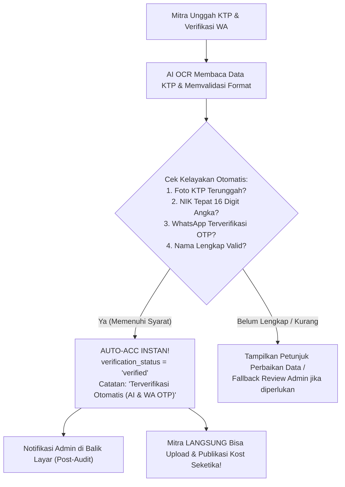

# Rencana Implementasi: Verifikasi Identitas Kilat & Otomatis (Instant Auto-ACC) Berbasis AI & WhatsApp OTP (`MitraProfile.tsx`)

Dokumen ini merinci rencana implementasi proses verifikasi identitas instan bagi calon pemilik kost (mitra) untuk mengeliminasi hambatan (*friction*) dan waktu tunggu 1x24 jam saat pertama kali mendaftar:
1. **Verifikasi Kilat (Instant Auto-ACC)**: Calon mitra yang mengunggah foto KTP asli, memiliki NIK 16 digit valid, dan telah memverifikasi nomor WhatsApp via OTP 6-digit akan **LANGSUNG mendapatkan status `verified` seketika (0 detik waktu tunggu)**.
2. **Langsung Siap Upload Listing**: Status `verified` langsung membuka semua hak akses di dashboard mitra, termasuk menambah kamar, mengatur tarif sewa, dan mempublikasikan listing tanpa tertunda.
3. **Audit Pasif di Balik Layar (*Post-Audit Control*)**: Sistem tetap mencatat seluruh berkas di tabel `user_verifications` dan mengirimkan notifikasi audit ke admin. Admin memiliki wewenang mencabut (*revoke/ban*) jika di kemudian hari ditemukan kecurangan.

---

## 1. Analisis Masalah & Alur Saat Ini

### Hambatan Saat Ini:
- Di `MitraProfile.tsx` (baris 858), saat mitra menekan "Simpan & Ajukan Verifikasi", kode secara kaku menetapkan status:
  ```tsx
  updates.verification_status = 'pending';
  ```
- Di `MitraDashboard.tsx`, fungsi `checkVerification()` memblokir akses tambah kost jika `!isVerified`.
- Calon mitra yang sedang sangat bersemangat mempublikasikan kost terpaksa berhenti dan menunggu manual review admin hingga 24 jam. Ini menyebabkan *drop-off* calon mitra yang berharga.

### Alur Baru yang Diinginkan (Opsi 1):



---

## 2. Kriteria Validasi Otomatis (Instant Approval Guard)

Sistem akan mengevaluasi kondisi berikut saat tombol submit ditekan:
1. **Nomor WhatsApp Terverifikasi**: `waOtpVerified === true` atau `initialUser?.whatsapp_verified === true`. (Menjamin pemilik adalah orang riil dengan nomor telepon aktif yang bisa dihubungi).
2. **Format NIK Valid 16 Digit**: `/^\d{16}$/.test(formData.ktp_number.trim())`. (Mencegah input asal-asalan seperti "123" atau teks sembarangan).
3. **Foto KTP Resmi Terunggah**: `Boolean(formData.ktp_photo_url)`.
4. **Nama Lengkap Sesuai**: `formData.display_name.trim().length >= 3`.

**Hasil Evaluasi**:
- Jika ke-4 kriteria di atas terpenuhi $\rightarrow$ `verification_status` langsung ditetapkan menjadi **`'verified'`** (bukan `'pending'`).
- `verification_notes` dicatat sebagai: `Terverifikasi Otomatis oleh Sistem (Validasi Dokumen KTP & WhatsApp OTP)`.
- Data tersimpan serentak di tabel `users` dan `user_verifications` Supabase.
- Tampilan profil mitra langsung menampilkan lencana hijau: **`Akun Mitra Terverifikasi ✓`**.
- Modal / Alert selamat muncul: *"Selamat! Identitas Anda berhasil diverifikasi secara instan. Anda sekarang dapat langsung menambah dan mempublikasikan properti kost!"*

---

## 3. Dampak File yang Dimodifikasi

1. **`functions/public/pages/MitraProfile.tsx`**:
   - Memperbarui fungsi `handleSave` untuk mengevaluasi kriteria instan dan memberikan status `verified` seketika.
   - Menyesuaikan pesan status dan feedback agar mitra tahu bahwa akun mereka langsung aktif tanpa menunggu.
2. **`functions/PROGRESS.md`**:
   - Mencatat progres fitur nomor #432.
3. **`WALKTHROUGH.md`**:
   - Dokumentasi hasil verifikasi dan panduan uji coba.

---

## 4. Langkah-Langkah Eksekusi (Fase 2)

1. Memodifikasi logika penentuan status verifikasi di `handleSave` pada `MitraProfile.tsx`:
   - Menambahkan pengecekan kriteria validasi instan (`isEligibleForInstantApproval`).
   - Menyetel status menjadi `verified` jika lolos uji kelayakan.
2. Menyesuaikan banner notifikasi status di UI profil mitra agar mencerminkan aktivasi instan.
3. Menjalankan kompilasi build frontend `cmd.exe /c npm run build`.
4. Mencatat histori progres di `functions/PROGRESS.md` dan memperbarui `WALKTHROUGH.md`.
5. Melakukan commit dan push ke branch `bukan-productions`.

---

## 5. Rencana Verifikasi

- [ ] **Kompilasi Frontend**: `cmd.exe /c npm run build` lulus tanpa error.
- [ ] **Uji Coba Pengajuan KTP**:
  - Mitra mengunggah foto KTP, melengkapi NIK 16 digit, dan memverifikasi nomor WhatsApp via OTP.
  - Klik tombol simpan $\rightarrow$ status langsung menjadi **`Terverifikasi ✓`** dalam hitungan detik.
  - Navigasi ke menu "Kelola Kost" $\rightarrow$ Tombol "Tambah Kost" langsung dapat dibuka tanpa terblokir oleh `checkVerification()`.
