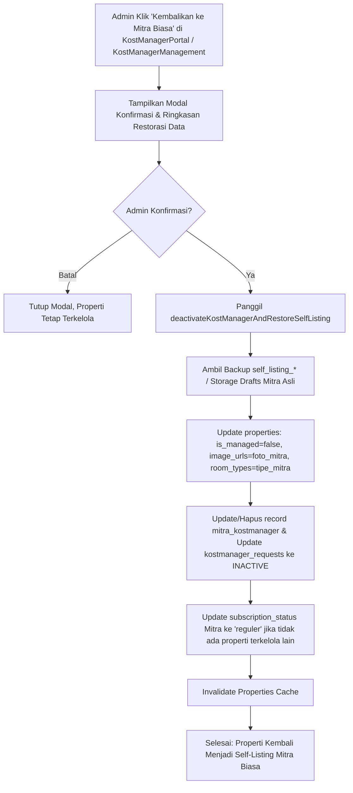

# Rencana Implementasi: De-aktivasi Properti KostManager & Pemulihan ke Mitra Biasa (Self-Listing) dengan Restorasi Foto & Data Mandiri Mitra

## 1. Analisis Kebutuhan & Masalah

### A. Konteks & Kebutuhan Pengguna
Pengguna menginstruksikan:
> *"saya ingin agar, jika sebuah list properti terkelola kostmanager, yang sebelumnnya adalah listing kost biasa self listing, jika dinonaktifkan dari list properti terkelola kostmanager, itu akan kembali menjadi mitra biasa atau self listing, dan kembali ke tampilan saat masih menjadi mitra biasa atau self listing. seluruh data-datanya kembali ke informasi dan foto yang diupload secara mandiri oleh mitra bukan hasil dari pendataan agen"*

### B. Akar Masalah Teknis Saat Ini
1. **Ketiadaan Aksi De-aktivasi / Lepas Kelola di Portal KostManager (`KostManagerPortal.tsx`)**:
   - Pada tabel **Properti Terkelola** (`/dashboard-admin/km_properties`), aksi yang tersedia saat ini hanya:
     - *Bekukan Properti / Banned* (`ShieldAlert`): hanya mengubah status menjadi `'suspended'`.
     - *Hapus Properti Permanen* (`Trash2`): menghapus total rekaman properti dari database.
   - Belum tersedia tombol atau alur **"Nonaktifkan KostManager & Kembalikan ke Mitra Biasa"** yang bertugas melepas kelolaan tanpa menghapus properti dari sistem.
2. **Penimpaan Data Saat Onboarding Surveyor**:
   - Saat agen surveyor menyelesaikan pendataan lapangan, properti di tabel `properties` diperbarui dengan unit kamar individual (kamar 1-10) dan foto-foto survei lapangan (`properties/kostmanager/drafts/...`).
   - Jika layanan KostManager dihentikan, sistem belum memiliki alur otomatis untuk me-restore kolom `image_urls`, `room_types`, `facilities`, dan `metadata` kembali ke data mandiri asli yang diunggah mitra.
3. **Data Properti Aktif ("Kost Apalah Daya")**:
   - Properti `bb6b0ccc-6d9e-494a-b972-aa7dd9cbd81f` dibuat sebagai self-listing pada 2 September 2026 dan memiliki 33 berkas foto asli mandiri di Supabase Storage (`properties/drafts/a29dd46f-7754-4da4-904e-6b90176bc15d/`).
   - Karena disurvei sebelum mekanisme backup `self_listing_*` diterapkan, properti ini perlu di-backfill cadangannya di kolom `metadata` agar kapan saja dinonaktifkan, seluruh foto mandiri mitra langsung pulih 100%.

---

## 2. Dampak Perubahan (File yang Tersentuh)

1. **`functions/public/adminService.ts`**:
   - Membuat fungsi `deactivateKostManagerAndRestoreSelfListing(propertyId: string)` yang menangani:
     - Restorasi `image_urls`, `room_types`, `facilities`, `rules`, dan `description` ke data mandiri mitra.
     - Penyetelan `is_managed = false` dan `status = 'published'` pada tabel `properties`.
     - Penonaktifan record di tabel `mitra_kostmanager` (`status = 'inactive'` atau penghapusan record kelolaan).
     - Pengubahan status tiket di `kostmanager_requests` menjadi `'TERMINATED'` / `'INACTIVE'`.
     - Pengembalian `subscription_status` mitra ke `'reguler'` jika tidak ada properti terkelola lain.
     - Pembersihan cache properti publik via `invalidatePropertiesCache()`.
   - Memperbarui fungsi `deleteKostManagerRequest(id: string)` agar terintegrasi dengan pemulihan ini jika tiket yang dihapus berstatus aktif.

2. **`functions/public/components/admin/KostManagerPortal.tsx`**:
   - Menambahkan tombol aksi operasional baru: **"Kembalikan ke Mitra Biasa (Self-Listing)"** (ikon `RotateCcw` / `Building2` berwarna oranye/amber) pada setiap baris properti terkelola.
   - Menambahkan modal dialog konfirmasi konseptual:
     - Menjelaskan bahwa properti akan keluar dari portofolio KostManager.
     - Menampilkan pratinjau bahwa foto surveyor akan digantikan kembali oleh foto mandiri mitra.
     - Menampilkan tombol aksi konfirmasi: *"Kembalikan ke Mitra Biasa"*.

3. **`functions/public/components/admin/KostManagerManagement.tsx`**:
   - Menambahkan tombol *"Nonaktifkan Layanan & Kembalikan ke Self-Listing"* pada drawer/modal detail peninjauan kelolaan tiket KostManager.

4. **Sinkronisasi Database Supabase (Backfill Data "Kost Apalah Daya")**:
   - Memastikan properti `bb6b0ccc-6d9e-494a-b972-aa7dd9cbd81f` memiliki cadangan `self_listing_images` (dari 33 foto asli di storage `properties/drafts/a29dd46f-7754-4da4-904e-6b90176bc15d/`), `self_listing_room_types` (Tipe Standard & Premium), dan fasilitas awal mitra.

---

## 3. Langkah-Langkah Eksekusi (Fase 2)

### Langkah 1: Backfill Data Mandiri Properti "Kost Apalah Daya"
- Menyiapkan script backfill untuk mengisi `metadata.self_listing_images`, `metadata.self_listing_room_types`, dan `metadata.self_listing_facilities` pada properti `bb6b0ccc-6d9e-494a-b972-aa7dd9cbd81f` menggunakan foto mandiri asli yang ada di storage `drafts/a29dd46f-7754-4da4-904e-6b90176bc15d`.

### Langkah 2: Pembuatan Fungsi Restorasi di `adminService.ts`
- Mengimplementasikan `deactivateKostManagerAndRestoreSelfListing(propertyId)`:
  - Mengambil data properti dan mengekstrak `metadata.self_listing_*`.
  - Jika backup kosong, menggunakan fallback pencarian berkas mandiri mitra di storage `drafts/${ownerUid}` dan memfilter keluar seluruh URL yang mengandung `kostmanager/drafts/`.
  - Mengembalikan `is_managed = false` dan menyimpan data mandiri ke tabel `properties`.
  - Menghapus/menonaktifkan entri terkait di `mitra_kostmanager` dan memperbarui `kostmanager_requests`.
  - Memanggil `invalidatePropertiesCache()`.

### Langkah 3: Integrasi UI pada `KostManagerPortal.tsx`
- Menambahkan tombol aksi operasional di tabel `activeTab === 'properties'`.
- Menambahkan state modal konfirmasi `propToDeactivate` dan handler eksekusi yang aman dengan indikator loading.
- Memperbarui state lokal agar properti yang dinonaktifkan langsung keluar dari tabel Properti Terkelola.

### Langkah 4: Integrasi UI pada `KostManagerManagement.tsx`
- Menambahkan tombol de-aktivasi pada modal drawer review permintaan tiket aktif.
- Menyesuaikan handler penghapusan tiket agar menawarkan opsi pemulihan listing ke mitra biasa.

### Langkah 5: Uji Kompilasi & Verifikasi
- Menjalankan `npm.cmd run build` di `functions/public` untuk memastikan 0 error kompilasi.
- Menguji fungsi de-aktivasi dan memastikan tampilan di Dashboard Mitra dan Katalog Publik kembali normal sebagai listing reguler.

---

## 4. Rencana Verifikasi

1. **Uji Kompilasi**:
   - Menjalankan `npm.cmd run build` di direktori `functions/public`.
   - Memastikan tidak ada error TypeScript maupun bundling Vite.
2. **Verifikasi Tampilan & Data Setelah De-aktivasi**:
   - **Di Portal KostManager (`/dashboard-admin/km_properties`)**: Properti tidak lagi muncul dalam daftar Properti Terkelola.
   - **Di Dashboard Mitra (`/dashboard-mitra/properties`)**:
     - Badge oranye "KostManager Auto-Pilot" hilang.
     - Properti tampil sebagai listing mandiri biasa dengan kontrol ketersediaan kamar reguler.
     - Foto yang tampil adalah foto mandiri yang diunggah oleh mitra, bukan foto agen surveyor.
   - **Di Katalog Publik (`/listings` dan Beranda)**:
     - Badge biru "TERVERIFIKASI" (khusus KostManager) hilang.
     - Tipe kamar dan harga kembali ke format self-listing mitra biasa.
3. **Dokumentasi & Git**:
   - Mencatat progres ke `functions/PROGRESS.md`.
   - Membuat `WALKTHROUGH.md`.
   - Melakukan commit dan push ke branch `bukan-productions`.
