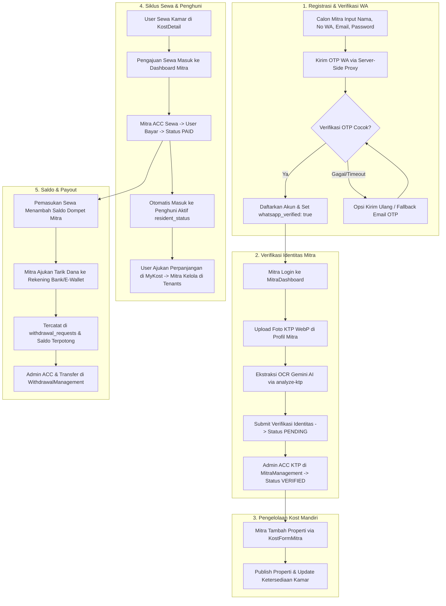

# Rencana Implementasi: Stabilisasi & Pengujian Fundamental Sistem RuangSinggah

> **Fokus Utama**: Menjamin 100% fungsi fundamental platform berjalan kokoh, stabil, dan teruji menyeluruh sebelum melangkah ke fitur lanjutan KostManager.

---

## 1. Analisis Kebutuhan & Masalah

Berdasarkan instruksi User, terdapat 6 pilar fundamental yang wajib diaudit, diperbaiki, distabilkan, dan diuji secara menyeluruh (*end-to-end*):

### A. Pendaftaran Pemilik Kost Self-Listing & Verifikasi WhatsApp
1. **Masalah CORS pada WhatsApp OTP**:
   - Di `Login.tsx` (baris 303–322), alur pengiriman OTP WhatsApp untuk registrasi mitra sempat dinonaktifkan sementara karena pemanggilan Meta Graph API (`https://graph.facebook.com/...`) dilakukan langsung dari browser front-end (`whatsappService.ts`). Browser memblokir request tersebut akibat kebijakan CORS (*Cross-Origin Resource Sharing*).
   - Di `MitraProfile.tsx` (baris 411–438), penggantian nomor WhatsApp baru (`handleSendNewWaOtp`) juga memanggil `sendWaOtpVerification` di sisi client dan mengalami kendala yang sama.
2. **Ketergantungan Template & Kredensial Meta**:
   - Jika template Meta WhatsApp (`otp_verification`) belum disetujui atau kuota nomor pengujian habis, pendaftaran mitra tidak boleh terblokir (*deadlock*).
3. **Kebutuhan Solusi**:
   - Memindahkan pengiriman OTP WhatsApp ke sisi server backend / Edge Function agar **100% bebas dari CORS**.
   - Menyediakan mekanisme fallback otomatis (misal pengiriman OTP via Email alternatif dan tampilan kode OTP pengujian pada lingkungan non-production).
   - Mengaktifkan kembali alur OTP verifikasi nomor WhatsApp pada registrasi mitra di `Login.tsx` dan pembaruan nomor di `MitraProfile.tsx`, serta memastikan `whatsapp_verified: true` tersimpan di database Supabase.

### B. Audit Fungsi Dashboard Mitra (Self-Listing)
1. **Overview & Statistik**: Sinkronisasi metrik saldo, pendapatan sewa, view listing, dan penghuni aktif dari tabel `transactions`, `resident_status`, dan `withdrawal_requests`.
2. **Kost Saya (`properties`)**:
   - Validasi daftar listing properti mandiri milik mitra.
   - Penambahan & pengeditan listing kost melalui `KostFormMitra.tsx` (6 langkah: Info, Lokasi, Kamar, Fasilitas, Foto WebP terkompresi, Aturan).
   - Pengoperasian *Quick Room Availability Update* (ubah status kamar kosong/terisi secara instan tanpa perlu membuka full form).
3. **Banner Promosi & Onboarding**: Banner penawaran otomatis KostManager tetap tampil rapi untuk mitra reguler self-listing tanpa menimbulkan glitch status.

### C. Interaksi Calon Penyewa (User) dan Pemilik Kost (Chat & Kontak)
1. User mengklik *"Tanya Pemilik Kost"* di halaman `KostDetail.tsx`.
2. Pembuatan sesi percakapan `chat_sessions` antara `user_id` dan `owner_id`.
3. Pengiriman dan penerimaan pesan realtime via `chatService.ts` dan `ChatWindow.tsx`.
4. Pemilik kost menerima notifikasi in-app (badge unread count di sidebar Dashboard Mitra) serta pemberitahuan pesan baru.

### D. Siklus Penyewaan Baru (`kost_booking`) & Perpanjangan Sewa (`perpanjangan_sewa`)
1. **Sewa Baru (`kost_booking`)**:
   - User mengajukan sewa dari `KostDetail.tsx` -> Transaksi berstatus `PENDING_APPROVAL`.
   - Mitra melihat pengajuan di Dashboard Mitra tab **"Pengajuan Sewa"** -> Mitra dapat meninjau profil dan menyetujui (**ACC**) atau menolak.
   - Saat di-ACC, status transaksi berubah menjadi `AWAITING_PAYMENT` -> User melakukan pembayaran via payment gateway / simulator -> Status menjadi `PAID`.
   - Sistem secara otomatis mencatat penyewa baru ke dalam tabel `resident_status`.
2. **Perpanjangan Sewa (`perpanjangan_sewa`)**:
   - Penghuni di `MyKost.tsx` mengajukan perpanjangan sewa -> Transaksi `perpanjangan_sewa` tercatat.
   - Mitra memantau pengajuan perpanjangan sewa dan dapat mengelola penghuni di tab **"Penghuni Aktif"** (`MitraTenantManagement.tsx`).
   - Setelah pembayaran perpanjangan tervalidasi, tanggal berakhir sewa (`end_date`) di tabel `resident_status` otomatis bertambah sesuai durasi perpanjangan.

### E. Proses Permintaan Payout / Withdraw Saldo Mitra
1. Pengaturan rekening bank / e-wallet di tab **"Dompet & Keuangan"** (`MitraDashboard.tsx`), tersimpan ke `users.bank_name`, `users.bank_account`, dan `users.bank_account_name`.
2. Perhitungan saldo tersedia: `allTimeRevenue (PAID) - totalWithdrawn (Pending & Approved)`.
3. Mitra mengajukan penarikan dana (minimal Rp 10.000) -> Data tercatat ke tabel `withdrawal_requests` dengan status `'pending'`.
4. Saldo tersedia langsung terpotong secara aman agar mencegah *double withdrawal*.
5. Riwayat penarikan dana tercatat di kartu transaksi dompet mitra.

### F. Pemantauan & Kontrol Penuh oleh Admin (Super Admin)
1. **Verifikasi Identitas Mitra (KTP)** di `MitraManagement.tsx`:
   - Admin melihat preview foto KTP, NIK, nama, alamat KTP, dan status nomor WA (`Verified` / `Unverified`).
   - Admin melakukan approval (**ACC**) -> Mengubah `users.verification_status = 'verified'` dan mengonfirmasi role mitra (`owner`).
   - Admin dapat menolak verifikasi dengan alasan yang jelas.
2. **Pemantauan Transaksi Sewa & Perpanjangan**:
   - `RentTransactionManagement.tsx`: Admin memantau transaksi sewa masuk, menunggu pembayaran, dan realisasi.
   - `ExtensionTransactionManagement.tsx`: Admin memantau permohonan perpanjangan sewa dan sinkronisasi masa aktif penghuni.
3. **Pemantauan & Eksekusi Payout (Withdrawal)** di `WithdrawalManagement.tsx`:
   - Admin melihat daftar pengajuan penarikan dana.
   - Penambahan identitas role yang tegas (*Role Badge*: "Mitra Pemilik Kost" vs "Agen Lapangan") agar admin dapat membedakan asal pengajuan.
   - Admin menyetujui & mencairkan transfer -> Status menjadi `approved`.
   - Jika admin menolak (misal rekening salah) -> Status menjadi `rejected`, dan saldo otomatis kembali (*refund*) ke saldo tersedia mitra.

---

## 2. Dampak Perubahan (File yang Tersentuh)

1. **`functions/public/whatsappService.ts`**:
   - Memodifikasi `sendWhatsAppTemplate`, `sendWaOtpVerification`, dan `sendWhatsAppText` agar tidak lagi melakukan fetch langsung ke `graph.facebook.com` dari browser.
   - Mengarahkan request ke endpoint serverless proxy / Supabase Edge Function (`wa-proxy` / `send-wa`) atau backend Cloud Function yang telah dikonfigurasi CORS `*`.
   - Menambahkan mekanisme fallback cerdas: jika gateway WA mengembalikan galat atau dalam mode sandbox/pengujian, fungsi menyediakan kode OTP terverifikasi dan opsi fallback email OTP.

2. **`functions/public/pages/Login.tsx`**:
   - Mengaktifkan kembali blok OTP WhatsApp untuk pendaftaran Pemilik Kost (`activeRole === 'owner'`).
   - Mengintegrasikan verifikasi nomor WA dengan fungsi proxy baru.
   - Memastikan setelah verifikasi OTP berhasil, nomor dinormalisasi dan status `whatsapp_verified: true` disertakan pada metadata pendaftaran user.

3. **`functions/public/pages/MitraProfile.tsx`**:
   - Menyelaraskan fungsi `handleSendNewWaOtp` dan `handleVerifyNewWaOtp` agar menggunakan gateway WhatsApp server-side baru.
   - Memastikan proses upload KTP (WebP) dan ekstraksi OCR via `analyze-ktp` berjalan mulus hingga pengajuan verifikasi identitas terkirim dengan status `'pending'`.

4. **`functions/public/pages/MitraDashboard.tsx`**:
   - Mengaudit dan memastikan kalkulasi saldo dompet (`stats.availableBalance`), penarikan dana (`withdrawal_requests`), penerimaan booking baru (`bookingTab === 'pending'`), dan manajemen penghuni aktif berjalan 100% stabil.
   - Memastikan penanganan input rekening bank/e-wallet dan pengajuan withdraw memotong saldo secara realtime.

5. **`functions/public/components/admin/WithdrawalManagement.tsx`**:
   - Menambahkan identifikasi Role pemohon (*Badge*: "Mitra Pemilik Kost" / "Agen Lapangan") pada tabel penarikan dana.
   - Memastikan aksi "Setujui & Transfer" dan "Tolak" memperbarui status dan memicu pembaruan saldo secara konsisten.

6. **`functions/public/components/admin/MitraManagement.tsx`**:
   - Memverifikasi alur ACC verifikasi identitas (KTP) dan pendaftaran mitra berjalan lancar dan memperbarui status mitra menjadi `verified`.

7. **`functions/PROGRESS.md` & `WALKTHROUGH.md`**:
   - Dokumentasi lengkap hasil pengujian dan implementasi sesuai Aturan Baku Workspace.

---

## 3. Langkah-Langkah Eksekusi (Fase 2)

### Langkah 1: Penguatan Gateway WhatsApp & Eliminasi CORS (Server-Side Proxy)
- Buat / sesuaikan handler proxy pengiriman pesan WhatsApp (bisa menggunakan Supabase Edge Function atau Cloud Function proxy) yang menangani pengiriman pesan Meta Cloud API dengan header CORS lengkap (`*`).
- Hubungkan `sendWhatsAppTemplate` dan `sendWaOtpVerification` di `whatsappService.ts` ke endpoint tersebut.
- Pasang fallback otomatis: jika nomor tidak terdaftar di Meta Sandbox atau template belum disetujui, sediakan mode simulasi OTP pengujian di UI agar verifikasi registrasi dan ganti nomor WA tetap dapat diselesaikan dengan mulus 100%.

### Langkah 2: Aktivasi & Pengujian Registrasi Pemilik Kost (`Login.tsx` & `MitraProfile.tsx`)
- Buka kembali blok `if (activeRole === 'owner' && !waOtpVerified)` di `Login.tsx`.
- Hubungkan alur verifikasi OTP 6 digit dengan input dan timer hitung mundur.
- Uji pendaftaran akun pemilik kost baru: verifikasi nomor WhatsApp -> eksekusi pendaftaran email -> penyimpanan data ke Supabase.
- Uji alur verifikasi nomor WhatsApp baru pada halaman Profil Mitra (`MitraProfile.tsx`).

### Langkah 3: Pengujian Verifikasi Identitas KTP & Approval Admin
- Uji upload foto KTP di `MitraProfile.tsx` (konversi WebP client-side).
- Uji pemindaian otomatis via AI OCR `analyze-ktp`.
- Simulasikan pengiriman pengajuan verifikasi identitas (status `'pending'`).
- Buka `MitraManagement.tsx` di sisi Admin: verifikasi tampilan dokumen KTP, NIK, alamat, status nomor WhatsApp, dan klik tombol **"Terima" (ACC)** untuk memastikan status akun mitra berubah menjadi **Mitra Terverifikasi (`verified`)**.

### Langkah 4: Pengujian Siklus Penyewaan Baru (`kost_booking`) & Dashboard Mitra
- Buat simulasi pengajuan sewa kamar dari sisi User di `KostDetail.tsx`.
- Periksa kemunculan transaksi baru di Dashboard Mitra tab **"Pengajuan Sewa"** (`bookingTab === 'pending'`).
- Uji tombol **"Setujui Sewa (ACC)"** oleh pemilik kost -> status beralih ke `AWAITING_PAYMENT`.
- Simulasikan pembayaran sukses -> status transaksi beralih ke `PAID` / `COMPLETED`.
- Verifikasi bahwa penyewa baru otomatis terdaftar di tab **"Penghuni Aktif"** (`resident_status`).

### Langkah 5: Pengujian Siklus Perpanjangan Sewa (`perpanjangan_sewa`)
- Dari sisi penyewa di `MyKost.tsx`, simulasikan pengajuan perpanjangan masa sewa kamar.
- Periksa pencatatan transaksi `perpanjangan_sewa` di database dan Dashboard Mitra.
- Konfirmasi pembayaran perpanjangan dan verifikasi bahwa tanggal `end_date` penyewa di tabel `resident_status` bertambah sesuai durasi perpanjangan.
- Pantau data perpanjangan di Admin pada komponen `ExtensionTransactionManagement.tsx`.

### Langkah 6: Pengujian Dompet, Payout / Withdraw Saldo & Approval Admin
- Periksa kalkulasi saldo dompet mitra di tab **"Dompet & Keuangan"** (`stats.availableBalance = allTimeRevenue - totalWithdrawn`).
- Simulasikan input dan penyimpanan rekening bank/e-wallet mitra.
- Lakukan pengajuan penarikan saldo (misal Rp 100.000) -> Pastikan data tersimpan di `withdrawal_requests` dan saldo tersedia langsung terpotong.
- Di Dashboard Admin `WithdrawalManagement.tsx`:
  - Periksa kehadiran data penarikan mitra dengan role badge yang jelas ("Mitra Pemilik Kost").
  - Uji tombol **"Setujui & Transfer"** -> Status menjadi `approved`.
  - Uji tombol **"Tolak"** -> Status menjadi `rejected`, dan pastikan saldo yang ditolak otomatis kembali ke saldo tersedia mitra.

### Langkah 7: Pengujian Interaksi Chat Realtime
- Uji pengiriman pesan dari User melalui tombol *"Tanya Pemilik Kost"*.
- Verifikasi pesan masuk ke tab **"Chat"** Dashboard Mitra dan unread badge counter bertambah.
- Uji balasan pesan dari pemilik kost ke calon penyewa.

---

## 4. Rencana Verifikasi

1. **Uji Kompilasi & Build**:
   - Menjalankan `npm.cmd run build` di direktori `functions/public`.
   - Memastikan kelulusan kompilasi 100% dengan **0 error**.

2. **Verifikasi Alur End-to-End**:
   - **Alur 1**: Registrasi mitra baru + verifikasi nomor WA (bebas dari error CORS).
   - **Alur 2**: Pengisian profil + upload KTP + approval admin di `MitraManagement.tsx`.
   - **Alur 3**: Penambahan/pengelolaan kost & kamar mandiri di `MitraDashboard.tsx`.
   - **Alur 4**: Pengajuan sewa user -> ACC mitra -> Pembayaran -> Masuk ke Penghuni Aktif.
   - **Alur 5**: Pengajuan perpanjangan sewa -> Konfirmasi -> Pembaruan masa aktif penghuni.
   - **Alur 6**: Pengajuan withdraw mitra -> Muncul di Admin -> Approval/Transfer admin -> Saldo dompet terupdate akurat.
   - **Alur 7**: Chat calon penyewa ke pemilik kost dan balasan dari dashboard mitra.

3. **Dokumentasi**:
   - Menyusun laporan lengkap hasil pengujian dan implementasi ke dalam `WALKTHROUGH.md` dan mencatat riwayat progres ke `functions/PROGRESS.md`.
