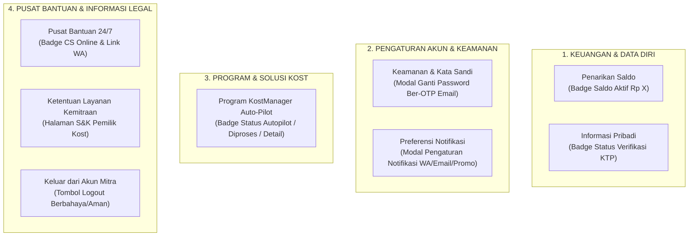

# Rencana Implementasi: Penataan Struktur Menu Profil Mitra & Pemisahan Kategori Program dan Pusat Bantuan (`MitraProfile.tsx`)

Dokumen ini merinci penyesuaian arsitektur menu profil mitra (`MitraProfile.tsx`) sesuai arahan terbaru:
1. Menjadikan **PENGATURAN AKUN & KEAMANAN** sebagai kategori terpisah (memuat *Keamanan & Kata Sandi* ber-OTP dan *Preferensi Notifikasi*), serasi dengan tampilan profil pencari kost (`Profile.tsx`).
2. Menata kategori pertama **KEUANGAN & DATA DIRI** memuat *Penarikan Saldo* dan *Informasi Pribadi*.
3. Memisahkan **PROGRAM & SOLUSI KOST** (*Program KostManager Auto-Pilot*) dengan **PUSAT BANTUAN & INFORMASI LEGAL** (*Pusat Bantuan 24/7* & *Ketentuan Layanan Kemitraan*) menjadi dua grup kategori independen.

---

## 1. Analisis Kebutuhan & Desain Hierarki 4 Kategori Menu

Hierarki menu profil mitra yang akan diimplementasikan:



### Rincian Pembagian Kategori:
1. **Grup 1: KEUANGAN & DATA DIRI**
   - **`Penarikan Saldo`**: Akses dompet penghasilan sewa, saldo aktif (`availableBalance`), dan rekening bank penarikan.
   - **`Informasi Pribadi`**: Kontak profil, nomor WA terverifikasi, alamat domisili, dan dokumen KTP resmi.

2. **Grup 2: PENGATURAN AKUN & KEAMANAN** *(Sesuai Standar Profil User)*
   - **`Keamanan & Kata Sandi`**: Ikon `<Lock />` biru $\rightarrow$ membuka modal ganti kata sandi berproteksi verifikasi Email OTP 6-digit (keamanan tinggi).
   - **`Preferensi Notifikasi`**: Ikon `<Bell />` amber $\rightarrow$ membuka modal toggle preferensi notifikasi WhatsApp, Email Laporan, & Promo/Fitur Baru.

3. **Grup 3: PROGRAM & SOLUSI KOST** *(Kategori Mandiri)*
   - **`Program KostManager Auto-Pilot`**: Layanan manajemen properti otomatis bagi pemilik kost tanpa repot, dengan badge status (`Autopilot 👑`, `Diproses`, atau navigasi ke detail program).

4. **Grup 4: PUSAT BANTUAN & INFORMASI LEGAL** *(Kategori Mandiri)*
   - **`Pusat Bantuan 24/7`**: Menghubungkan ke layanan CS WhatsApp & tim operasional RuangSinggah.
   - **`Ketentuan Layanan Kemitraan`**: Syarat, ketentuan & panduan hukum pemilik kost (`/terms`).
   - **`Keluar dari Akun Mitra`**: Tombol logout akun mitra.

---

## 2. Fitur Baru: Modal Preferensi Notifikasi Mitra

Mengadopsi pola modal dari `Profile.tsx` yang sudah stabil:
- **State Pengaturan**:
  ```tsx
  const [isNotifModalOpen, setIsNotifModalOpen] = useState(false);
  const [notifSettings, setNotifSettings] = useState({
      waNotif: true,
      emailNotif: true,
      promoNotif: false,
  });
  ```
- **Opsi Toggle**:
  1. **Notifikasi WhatsApp**: Notifikasi pembayaran sewa masuk, verifikasi penyewa, dan pesan darurat.
  2. **Notifikasi Email**: Rekap bulanan pendapatan sewa, faktur transaksi, dan notifikasi keamanan akun.
  3. **Info Program & Promo**: Rekomendasi pengelolaan hunian dan penawaran fitur KostManager.

---

## 3. Pencegahan FOUT & Standar Kualitas

- Seluruh ikon menggunakan SVG murni yang diimpor dari **`lucide-react`**:
  - `<Wallet />`, `<UserCheck />`, `<Lock />`, `<Bell />`, `<Sparkles />`, `<HelpCircle />`, `<FileText />`, `<LogOut />`, `<ChevronRight />`, `<Check />`, `<X />`, dll.
- 0 Google font ligatures, 0ms FOUT delay.
- Desain konsisten dengan border halus (`border-gray-100 divide-y divide-gray-50`), rounded cards (`rounded-3xl`), dan tracking label uppercase (`text-[11px] font-black uppercase text-gray-400 tracking-wider mb-2.5 px-1`).

---

## 4. Dampak File yang Akan Dimodifikasi

1. **`functions/public/pages/MitraProfile.tsx`**:
   - Menambahkan state `isNotifModalOpen` & `notifSettings`.
   - Mengelompokkan tampilan menu menjadi 4 kategori terpisah sesuai desain.
   - Menambahkan Modal Preferensi Notifikasi di dalam modal container.
2. **`functions/PROGRESS.md`**:
   - Mencatat histori penyelesaian progres #429.
3. **`WALKTHROUGH.md`**:
   - Dokumentasi hasil verifikasi kompilasi dan panduan pengujian visual.

---

## 5. Rencana Verifikasi

- [ ] **Kompilasi Frontend**: Menjalankan `cmd.exe /c npm run build` di direktori `functions/public` (wajib 0 error, exit code 0).
- [ ] **Struktur 4 Kategori**: Memastikan layout menu terbagi jelas menjadi 4 bagian independen dengan header masing-masing.
- [ ] **Modal Keamanan & Notifikasi**: Memastikan modal ganti kata sandi ber-OTP dan modal preferensi notifikasi dapat dibuka, ditutup, dan berfungsi sempurna.
