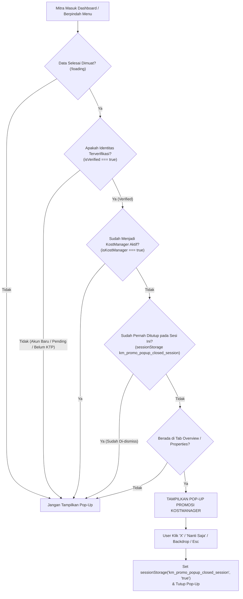

# Rencana Implementasi: Validasi Status Verifikasi Identitas & Kontrol Frekuensi Pop-Up Promosi KostManager (`MitraDashboard.tsx`)

Dokumen ini merinci analisis dan rencana perbaikan atas keluhan pengguna terkait kemunculan pop-up promosi KostManager:
1. **Syarat Wajib Terverifikasi (`isVerified`)**: Pop-up promosi KostManager **HANYA** boleh tampil jika mitra pemilik kost telah menyelesaikan dan lolos verifikasi identitas resmi (`user?.verification_status === 'verified'`). Akun baru yang belum terverifikasi (`unverified`, `pending`, `rejected`, atau `banned`) **DILARANG KERAS** menampilkan pop-up ini.
2. **Pencegahan Muncul Berulang-ulang (*Anti-Spam / Session Control*)**: Pop-up tidak boleh muncul terus-menerus setiap kali pengguna berpindah tab/menu atau me-refresh halaman. Setelah ditutup (tombol "X", "Nanti Saja", backdrop, atau tombol Esc), status dismiss disimpan di `sessionStorage` untuk sesi penjelajahan tersebut.

---

## 1. Analisis Masalah & Akar Penyebab

### Masalah:
- Akun mitra baru yang baru masuk dashboard dan belum diverifikasi identitasnya langsung disajikan pop-up promosi KostManager.
- Pop-up muncul secara terus-menerus (*annoying/spamming*) setiap kali mitra berpindah menu tab atau membuka dashboard.

### Akar Penyebab:
1. **Ketiadaan Pengecekan `isVerified` pada Pemicu Pop-Up**:
   - Di baris 224: `handleMenuChange` langsung memanggil `setShowPromoPopup(true)` tanpa memeriksa apakah akun sudah terverifikasi (`isVerified`).
   - Di baris 259: `useEffect` penayangan otomatis hanya memeriksa `!loading && !isKostManager && (activeMenu === 'overview' || activeMenu === 'properties')`, tanpa menyertakan `isVerified`.
   - Di baris 3876: Kondisi render JSX `{showPromoPopup && !loading && !isKostManager && (` juga tidak memiliki pengaman `isVerified`.
2. **Belum Terhubungnya Session Storage saat Pop-up Ditutup**:
   - Di baris 230: `handleClosePromoPopup` hanya memanggil `setShowPromoPopup(false)` tanpa mencatat flag penutupan di `sessionStorage`.
   - Akibatnya, setiap kali `activeMenu` berganti ke `overview` atau `properties`, `useEffect` dan `handleMenuChange` langsung memaksa `setShowPromoPopup(true)` kembali.

---

## 2. Solusi Teknis & Rencana Perubahan



### Langkah Perubahan Spesifik pada `MitraDashboard.tsx`:
1. **Proteksi di `useEffect` (Baris 258–264)**:
   - Tambahkan pengecekan:
     ```tsx
     useEffect(() => {
         if (!isVerified || isKostManager) {
             setShowPromoPopup(false);
             return;
         }

         const isDismissed = sessionStorage.getItem('km_promo_popup_closed_session') === 'true';
         if (!loading && !isDismissed && (activeMenu === 'overview' || activeMenu === 'properties')) {
             setShowPromoPopup(true);
         } else {
             setShowPromoPopup(false);
         }
     }, [activeMenu, isKostManager, isVerified, loading]);
     ```
2. **Pembersihan di `handleMenuChange` (Baris 223–228)**:
   - Hapus pemanggilan manual `setShowPromoPopup(true)` yang memicu pop-up berulang kali saat berpindah tab. Biarkan `useEffect` yang memiliki kendali session storage yang mengaturnya secara tertib.
3. **Pencatatan Dismiss di `handleClosePromoPopup` (Baris 230–232)**:
   - Simpan status di session storage agar tidak muncul lagi di sesi aktif:
     ```tsx
     const handleClosePromoPopup = useCallback(() => {
         setShowPromoPopup(false);
         try {
             sessionStorage.setItem('km_promo_popup_closed_session', 'true');
         } catch { }
     }, []);
     ```
4. **Proteksi Ganda pada Kondisi Render JSX (Baris 3876)**:
   - Perbarui kondisi render JSX:
     ```tsx
     {showPromoPopup && !loading && !isKostManager && isVerified && (
     ```

---

## 3. Dampak File yang Dimodifikasi

1. **`functions/public/pages/MitraDashboard.tsx`**:
   - Menambahkan pengaman `isVerified` dan `sessionStorage` pada alur kemunculan pop-up promosi KostManager.
2. **`functions/PROGRESS.md`**:
   - Mencatat progres fitur penyelesaian perbaikan nomor #430.
3. **`WALKTHROUGH.md`**:
   - Melampirkan dokumentasi pengujian dan verifikasi logika.

---

## 4. Rencana Verifikasi

- [ ] **Kompilasi Frontend**: Menjalankan `cmd.exe /c npm run build` di direktori `functions/public` untuk memastikan 0 error.
- [ ] **Simulasi Akun Belum Verifikasi**:
  - Akun baru atau yang statusnya belum `verified` masuk ke dashboard mitra $\rightarrow$ Pop-up promosi KostManager dipastikan **100% TIDAK MUNCUL**.
- [ ] **Simulasi Akun Terverifikasi**:
  - Akun yang sudah `verified` masuk ke overview $\rightarrow$ Pop-up promosi muncul sekali.
  - Saat ditutup (klik "X" atau "Nanti Saja"), berpindah-pindah tab tidak akan memunculkan pop-up lagi pada sesi tersebut.
