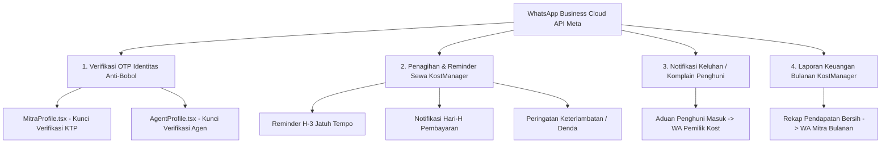

# Rencana Implementasi: Pengaktifan Ekosistem WhatsApp Cloud API Meta (Verifikasi Identitas Anti-Bobol & Otomasi KostManager)

Dokumen ini adalah **Implementation Plan (Fase 1)** untuk mengaktifkan seluruh fungsionalitas pengiriman pesan otomatis melalui nomor bisnis resmi **WhatsApp Cloud API Meta** di platform RuangSinggah.id.

---

## 1. Analisis Kebutuhan & Arsitektur Fitur

Sesuai arahan pengguna, integrasi WhatsApp Business Cloud API akan difokuskan pada 4 pilar operasional utama:

### A. Pilar 1: Verifikasi OTP WhatsApp Anti-Bobol (Mitra & Agen)
- **Masalah Saat Ini**:
  - Di `MitraProfile.tsx` & `AgentProfile.tsx`, validasi OTP WhatsApp sempat di-fallback ke `hello_world` atau tidak mengunci tombol pengajuan KTP (`handleSave`), sehingga pengguna bisa melewati verifikasi nomor telepon.
- **Solusi**:
  - **Hard Gatekeeper**: Form unggah KTP dan tombol submit verifikasi **terkunci total (disabled)** jika `whatsapp_verified !== true`.
  - **OTP Riil via Template Meta**: Mengirimkan kode 6-digit acak menggunakan template `otp_verification` resmi Meta.
  - **Anti-Spam & Limit**: Cooldown countdown 60 detik untuk tombol kirim ulang, dan batas maksimal 3x salah sebelum nomor dibatasi sementara.

### B. Pilar 2: Pengingat & Penagihan Sewa Otomatis KostManager
- **Penerima**: Penyewa / Penghuni aktif kamar KostManager.
- **Waktu Pemicuan**:
  - **H-3 Sebelum Jatuh Tempo**: Mengingatkan tagihan sewa periode berikutnya.
  - **Hari-H Jatuh Tempo**: Pesan konfirmasi pembayaran dengan link pembayaran Midtrans / kuitansi digital.
  - **H+1 (Terlambat)**: Notifikasi penambahan denda (*late fee*) sesuai konfigurasi platform jika belum dibayar.
- **Template Meta**: `reminder_tagihan_kost` (Kategori: Utility).

### C. Pilar 3: Notifikasi Keluhan / Komplain Baru KostManager
- **Penerima**: Mitra Pemilik Kost & Manajer Operasional KostManager.
- **Pemicu**: Setiap kali penghuni kamar mengajukan aduan baru melalui sistem komplain portal KostManager.
- **Template Meta**: `notifikasi_keluhan_baru` (Kategori: Utility).
- **Konten**: Nama kost, nomor kamar, kategori keluhan (AC/kebersihan/fasilitas rusak), ringkasan masalah, dan link respon cepat.

### D. Pilar 4: Notifikasi Rekap Keuangan Bulanan KostManager
- **Penerima**: Mitra Pemilik KostManager.
- **Pemicu**: Awal bulan ketika sistem atau admin men-generate rekapitulasi keuangan bulanan.
- **Template Meta**: `laporan_keuangan_bulanan` (Kategori: Utility).
- **Konten**: Periode bulan, total penerimaan sewa kotor, rincian biaya & potongan platform (5%), total bersih ditransfer, dan link dashboard pembukuan.

---

## 2. Dampak Perubahan (Files Touched)

1. **`functions/public/whatsappService.ts`**:
   - Menambahkan helper fungsi terstruktur untuk masing-masing skenario pengiriman:
     - `sendWaOtpVerification(phone, otpCode)`
     - `sendWaRentBillingReminder(phone, details)`
     - `sendWaTenantComplaintNotification(phone, details)`
     - `sendWaMonthlyFinancialReport(phone, details)`
   - Normalisasi nomor telepon otomatis ke format standar internasional `628xxxxxxxxxx`.
   - Logging dan error handling yang aman tanpa memblokir alur utama (*fail-safe non-blocking*).

2. **`functions/public/pages/MitraProfile.tsx` (Form Verifikasi Identitas Mitra)**:
   - Mengunci input KTP, NIK, dan tombol **"Ajukan Verifikasi Identitas"** jika `whatsapp_verified` belum bernilai `true`.
   - Menghapus fallback `hello_world` yang tidak berisi OTP.
   - Menambahkan proteksi limit percobaan input OTP (maksimal 3 kali).

3. **`functions/public/pages/AgentProfile.tsx` (Form Verifikasi Identitas Agen)**:
   - Menerapkan penguncian hard-gatekeeper OTP yang sama untuk pendaftaran verifikasi surveyor agen.

4. **`functions/public/notificationBridge.ts`**:
   - Menghubungkan pemicu event sistem (keluhan baru, billing sewa) ke helper WhatsApp yang baru.

5. **`functions/public/rentBillingService.ts`**:
   - Mengintegrasikan pengiriman WhatsApp reminder saat invoice sewa KostManager dibuat atau mendekati jatuh tempo.

6. **`functions/PROGRESS.md` & `WALKTHROUGH.md`**:
   - Dokumentasi lengkap hasil pengaktifan dan panduan pengujian.

---

## 3. Langkah-Langkah Eksekusi (Fase 2 - Setelah di-ACC)

### Tahap 1: Penyempurnaan & Modularisasi `whatsappService.ts`
- Implementasikan fungsi-fungsi spesifik untuk OTP Verifikasi, Penagihan Sewa, Notifikasi Keluhan, dan Laporan Keuangan.
- Pastikan konfigurasi membaca `VITE_WHATSAPP_PHONE_ID`, `VITE_WHATSAPP_ACCESS_TOKEN`, dan `VITE_WHATSAPP_WABA_ID`.

### Tahap 2: Penguncian Verifikasi Identitas Mitra ([`MitraProfile.tsx`](file:///c:/Users/ZHULL/Desktop/Firebase%20to%20Supabase/functions/public/pages/MitraProfile.tsx))
- Perbarui `handleSendWaOtp`: Kirim OTP riil via `sendWaOtpVerification`.
- Perbarui `handleVerifyWaOtp`: Validasi ketat, simpan status terverifikasi ke state dan database `users.whatsapp_verified = true`.
- Perbarui UI: Langkah 2 (Unggah KTP) hanya aktif jika Langkah 1 (OTP WA) sudah berstatus `Sudah Terverifikasi ✅`.
- Perbarui `handleSave`: Tolak pengajuan jika `whatsapp_verified` belum `true`.

### Tahap 3: Penguncian Verifikasi Identitas Agen ([`AgentProfile.tsx`](file:///c:/Users/ZHULL/Desktop/Firebase%20to%20Supabase/functions/public/pages/AgentProfile.tsx))
- Terapkan logika proteksi yang sama pada profil agen survei.

### Tahap 4: Integrasi Otomasi Notifikasi KostManager
- Sambungkan fungsi pengingat sewa di `rentBillingService.ts` dan notifikasi keluhan baru di `notificationBridge.ts`.

### Tahap 5: Uji Kompilasi & Build
- Jalankan `cmd /c npm run build` di `functions/public/` (memastikan 0 error build).
- Jalankan `cmd /c npm run build` di `functions/` (memastikan 0 error tsc).

### Tahap 6: Dokumentasi & Git Push
- Catat pembaruan di `functions/PROGRESS.md` dan sajikan `WALKTHROUGH.md`.
- Commit dan push ke branch `bukan-productions`.

---

## 4. Rencana Verifikasi

1. **Verifikasi Verifikasi Identitas**:
   - Masuk ke menu Profil Mitra / Agen $\rightarrow$ Coba langsung klik unggah KTP atau simpan verifikasi tanpa OTP.
   - Pastikan sistem menolak dengan pesan peringatan: *"Nomor WhatsApp wajib diverifikasi dengan kode OTP terlebih dahulu."*
   - Masukkan kode OTP salah $\rightarrow$ Pastikan sistem menolak.
   - Masukkan kode OTP benar yang masuk ke WA $\rightarrow$ Bagian KTP terbuka dan berhasil diajukan ke admin.
2. **Verifikasi Build**:
   - Front-end Vite build lulus 100% tanpa error.
