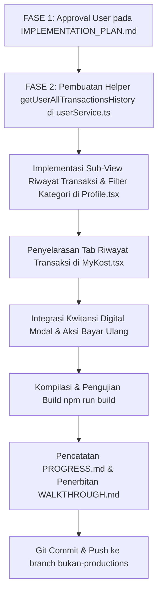

# IMPLEMENTATION PLAN: Integrasi Lengkap Riwayat Transaksi & Tagihan (5 Kategori) pada Profile Hub & MyKost

Dokumen ini adalah rencana implementasi komprehensif untuk menampilkan seluruh riwayat transaksi dan tagihan yang telah dilakukan pengguna pada sistem **RuangSinggah**.

---

## 1. Analisis Masalah & Kebutuhan

### A. Masalah Saat Ini
1. Pada menu Profile Hub Dashboard (`/profile`), opsi **"Riwayat Transaksi & Tagihan"** sebelumnya diarahkan ke `${Page.MY_BOOKINGS}/riwayat`, di mana tab tersebut hanya memfilter beberapa data sewa berstatus kedaluwarsa/selesai dan tidak merangkum seluruh transaksi multi-produk secara lengkap.
2. Pengguna yang telah melakukan berbagai jenis transaksi (membeli database kontak kost, memesan jasa survey lapangan, membayar DP sewa kamar baru, melakukan perpanjangan sewa bulanan, atau membayar tagihan fasilitas khusus/ekstra penghuni) belum dapat melihat rekapitulasi seluruh transaksi tersebut secara terstruktur dalam satu tempat dengan rincian invoice dan kwitansi digital.

### B. Ruang Lingkup 5 Kategori Transaksi yang Wajib Ditampilkan
1. 🗄️ **Beli Database Kost** (`database`, `database_access`, `product`): Pembelian paket kontak pemilik kost / database hunian.
2. 📍 **Jasa Survey Lokasi** (`survey`, `survey_order`, `survey_requests`): Pemesanan jasa survey fisik kamar & lingkungan kost oleh surveyor resmi.
3. 🏠 **Penyewaan Kost / DP Sewa** (`kost_booking`, `rent`, `kost`, `sewa`): Pembayaran booking kamar baru / DP sewa pertama.
4. 🔄 **Perpanjangan Sewa Kost** (`perpanjangan_sewa`, `extension`, `rent_extension`): Pembayaran perpanjangan masa sewa kamar kost aktif (bulanan/tahunan).
5. ⚡ **Tagihan Fasilitas Khusus & Ekstra** (`tagihan_ekstra`, `facility_bill`, `extra_occupant`, `billPayment`): Pembayaran tagihan listrik, AC, iuran kebersihan, ekstra penghuni, atau fasilitas tambahan kamar.

---

## 2. Dampak Perubahan (Files to Modify)

1. **`functions/public/userService.ts`**:
   - Menambahkan helper `getUserAllTransactionsHistory(userId: string)` untuk mengambil, menggabungkan, dan menormalisasi seluruh data transaksi dari tabel Supabase `transactions`, `resident_status`, dan `survey_requests` lengkap dengan rincian metadata produk.
2. **`functions/public/pages/Profile.tsx`**:
   - Memperluas state `viewMode: 'hub' | 'edit_personal_data' | 'favorites' | 'transactions'`.
   - Mengubah baris menu *"Riwayat Transaksi & Tagihan"* pada Profile Hub agar membuka Sub-view Transaksi (`viewMode === 'transactions'`).
   - Menyusun Sub-view **"Riwayat Transaksi & Tagihan"** yang kaya fitur:
     - Tombol navigasi `← Kembali ke Menu Profil`.
     - Tab filter kategori: *Semua Transaksi*, *Sewa Kost*, *Perpanjangan Sewa*, *Tagihan Fasilitas*, *Jasa Survey*, *Database Kost*.
     - Ringkasan statistik (Total Pengeluaran, Transaksi Lunas, Menunggu).
     - Kartu transaksi informatif: Nomor Invoice, Lencana Kategori berwarna, Status Pembayaran, Rincian Unit/Layanan, Tanggal, Metode Pembayaran, dan Tombol **"Kwitansi Digital"** (`DigitalReceiptModal`).
3. **`functions/public/pages/MyKost.tsx`**:
   - Menyempurnakan tab `'riwayat'` agar juga mendukung penampilan seluruh 5 kategori transaksi secara konsisten.
4. **`functions/PROGRESS.md`**:
   - Mencatat progres fitur #345.
5. **`WALKTHROUGH.md`**:
   - Membuat laporan hasil pengujian dan panduan user testing.

---

## 3. Langkah-Langkah Eksekusi Bertahap (Setelah Persetujuan User)

### Langkah Rinci:
1. **Langkah 1**: Buat fungsi `getUserAllTransactionsHistory(userId)` di `userService.ts` yang mengambil seluruh baris dari `transactions` (`user_id = userId`), memetakan `product_type` ke dalam 5 kategori standar, mengurai JSON `metadata`, dan melengkapinya dengan nama properti / nomor kamar.
2. **Langkah 2**: Modifikasi `Profile.tsx`:
   - Tambahkan state `userTransactions`, `loadingTransactions`, `selectedCategoryFilter`, dan `selectedReceipt`.
   - Tampilkan kartu ringkasan transaksi dan filter pill tabs 5 kategori.
   - Sediakan empty state yang ramah jika belum ada transaksi di kategori yang dipilih.
   - Integrasikan `DigitalReceiptModal` untuk mencetak / melihat kwitansi resmi.
3. **Langkah 3**: Sinkronisasi tab `'riwayat'` di `MyKost.tsx` untuk memastikan konsistensi data.
4. **Langkah 4**: Jalankan `npm.cmd run build` di `functions/public` untuk memastikan kompilasi 0 error.
5. **Langkah 5**: Perbarui `functions/PROGRESS.md` (#345), buat `WALKTHROUGH.md`, serta lakukan commit & push ke branch `bukan-productions`.

---

## 4. Rencana Verifikasi

1. **Uji Kompilasi**: Menjalankan `npm.cmd run build` di `functions/public` untuk memastikan tidak ada error TypeScript maupun bundling.
2. **Uji Fungsionalitas UI**:
   - Klik menu *"Riwayat Transaksi & Tagihan"* pada Profile Hub ➔ Tampilan langsung membuka Sub-view riwayat transaksi.
   - Filter tab kategori (Semua, Sewa Kost, Perpanjangan, Tagihan Fasilitas, Survey, Database) ➔ Menyaring transaksi secara akurat.
   - Klik *"Kwitansi Digital"* pada salah satu transaksi lunas ➔ Membuka modal kwitansi resmi RuangSinggah dengan rincian harga, tanggal, dan metode bayar.
   - Klik *"← Kembali ke Menu Profil"* ➔ Mengembalikan tampilan ke Profile Hub Dashboard.

---

> [!IMPORTANT]
> Sesuai protokol baku workspace, implementasi kode pada Fase 2 baru akan dieksekusi setelah Anda meninjau dan menyetujui (*Proceed / ACC*) rencana di atas.
