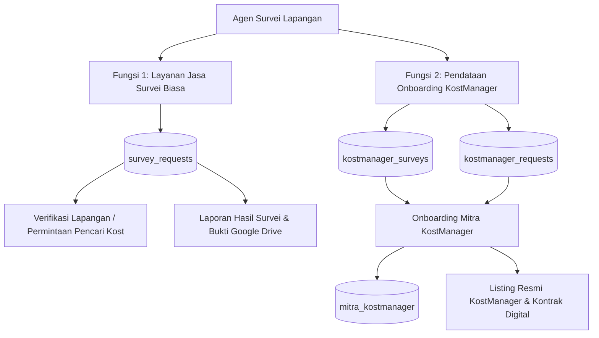

# PRD & ARSITEKTUR BAKU KOSTMANAGER (RUANGSINGGAH)

**Status:** ACTIVE & MANDATORY ARCHITECTURE RULE  
**Versi:** 1.0  
**Tanggal Penetapan:** September 2026  
**Otoritas:** User Directive & System Protocol

---

## 1. Latar Belakang & Filosofi Inti

Dalam ekosistem RuangSinggah, properti kost dapat beroperasi dalam dua mode kemitraan:
1. **Mitra Biasa (Self-Listing)**: Pemilik kost mendaftar secara mandiri, mengunggah foto sendiri, menentukan fasilitas sendiri, dan mengelola kamarnya secara independen.
2. **Mitra KostManager (Full-Managed)**: Pemilik kost berlangganan layanan KostManager, di mana properti kost diperiksa, diverifikasi, dan didata langsung di lapangan oleh Agen Surveyor resmi RuangSinggah dengan standar listing profesional.

> ### ⚠️ PRINSIP UTAMA (GOLDEN RULE - ZERO CONTAMINATION)
> **Seluruh data yang didata oleh agen surveyor bersifat EKSKLUSIF HANYA untuk layanan KostManager.**  
> Jika suatu saat properti kost tersebut **putus langganan / berhenti berlangganan KostManager**, properti tersebut akan **kembali menjadi Mitra Biasa**, dan data yang aktif ditampilkan ke publik adalah **data asli saat listing Mitra Biasa**.  
> Data listing mandiri milik Mitra Biasa **HARUS SELALU UTUH, TIDAK BOLEH TERHAPUS, TIDAK BOLEH TERTIMPA, DAN TIDAK BOLEH TERKONTAMINASI** oleh data survei KostManager.

---

## 2. Pemisahan Dua Fungsi Agen Survei (Separation of Concerns)

Agen Survei di Dashboard Lapangan (`AgentDashboard.tsx`) menjalankan **dua fungsi bisnis yang sepenuhnya berbeda dan wajib dipisahkan**:



### A. Fungsi 1: Jasa Survei Biasa (User / Regular Survey Service)
- **Tujuan**: Melayani produk pesanan jasa survei lokasi yang dipesan oleh calon pencari kost atau verifikasi lokasi independen.
- **Entitas Database**: Tabel `survey_requests`.
- **Alur Kerja**:
  - Agen menerima penugasan (`AGENT_ASSIGNED`).
  - OTW ke lokasi (`HEADING_TO_LOCATION`).
  - Melakukan survei fisik (`SURVEYING`).
  - Mengisi form laporan survei (kondisi lingkungan, akses jalan, bukti WhatsApp, link Google Drive, checklist evaluasi).
  - Mengirim laporan hasil survei ke pemesan/admin (`COMPLETED`).
- **Pemisahan**: Form ini tidak mengubah data kamar atau fasilitas di katalog publik properti kost.

### B. Fungsi 2: Pendataan Onboarding KostManager (Survey Field App)
- **Tujuan**: Melakukan audit fisik, pendataan spesifikasi properti, inventarisasi kamar, dokumentasi area publik dengan auto-sensor banner, dan tanda tangan digital SPK bagi mitra yang berlangganan KostManager.
- **Entitas Database**:
  - `kostmanager_requests`: Tiket langganan dan permintaan onboarding KostManager dari mitra.
  - `kostmanager_surveys`: Tiket penugasan surveyor lapangan untuk pendataan KostManager.
  - `mitra_kostmanager`: Data katalog operasional KostManager yang dipublikasikan setelah onboarding selesai.
- **Alur Kerja**:
  - Formulir Onboarding 3-Step (*Step 1: Properti, Step 2: Kamar, Step 3: Review & Tanda Tangan*).
  - Seluruh draf pendataan disimpan terisolasi di database dan storage khusus KostManager.

---

## 3. Arsitektur Isolasi Database: Mitra Biasa vs KostManager

Untuk menjamin prinsip reversibilitas saat langganan putus, struktur database diatur dengan isolasi total:

| Komponen | Status: Mitra Biasa (Self-Listing) | Status: Mitra KostManager (Aktif) | Saat Putus Langganan (Downgrade ke Mitra Biasa) |
| :--- | :--- | :--- | :--- |
| **Tabel Utama Katalog** | `properties` | `properties` (dengan `is_managed: true`) & `mitra_kostmanager` | `properties` (dengan `is_managed: false`) |
| **Foto-Foto Properti** | `properties.image_urls` / `metadata.self_listing_images` | `mitra_kostmanager.image_urls` (Aset surveyor profesional) | Dikembalikan ke `metadata.self_listing_images` / foto asli mitra |
| **Fasilitas Umum** | `properties.facilities` / `metadata.self_listing_facilities` | `mitra_kostmanager.facilities` (Hasil audit surveyor) | Dikembalikan ke `metadata.self_listing_facilities` |
| **Data Tipe Kamar** | `properties.room_types` / `metadata.self_listing_room_types` | `mitra_kostmanager.room_types` (Detail ukuran & foto surveyor) | Dikembalikan ke `metadata.self_listing_room_types` |
| **Isolasi Supabase Storage** | `properties/drafts/${userId}/...` | `properties/kostmanager/drafts/${surveyId}/...` | Foto surveyor tetap aman di folder KostManager tanpa menimpa foto mitra |

---

## 4. Aturan Baku Implementasi Kode (Implementation Guidelines)

1. **Dilarang Menimpa Data Asli Mitra**:
   - Saat agen membuka form onboarding KostManager (`openKostManagerListing`), data dari `dbPropertyRecord` hanya dibaca sebagai acuan awal (*prefill reference*).
   - Data asli mitra di `metadata.self_listing_*` **TIDAK BOLEH DIHAPUS ATAU DIUBAH** oleh agen.

2. **Dilarang Melakukan Re-Merging Fasilitas yang Menghapus Perubahan Agen**:
   - Jika draf KostManager sudah memiliki data fasilitas (`parsed.kmListingForm.facilities`), gunakan data draf tersebut secara mandiri.
   - **Dilarang keras** melakukan union paksa `Array.from(new Set([...draft, ...dbPropertyRecord]))` yang menyebabkan fasilitas yang dihapus agen di lapangan muncul kembali.

3. **Penyimpanan Draf Database yang Presisi**:
   - Draf pendataan KostManager wajib disimpan dengan mengidentifikasi tiket penugasan KostManager (`kostmanager_surveys.id` dan `transaction_id`).
   - Gunakan penyimpanan draf terisolasi di Supabase Cloud yang selalu sinkron dengan `localStorage` tanpa menimbulkan konflik dengan tiket jasa survei biasa.

4. **Pencegahan Error UUID pada Refresh**:
   - Semua pencarian dan routing berbasis URL parameter `onboarding_id` wajib menggunakan perbandingan string UUID murni:
     ```ts
     const found = surveyRequests.find(r => String(r.id) === String(onboardingIdStr));
     ```
   - Dilarang menggunakan `parseInt(id, 10)` pada UUID.

5. **Reversibilitas Otomatis saat Berhenti Berlangganan**:
   - Ketika langganan KostManager habis masa aktifnya atau diputus:
     - Flag `is_managed` pada tabel `properties` diubah menjadi `false`.
     - Data publik `properties` dikembalikan secara instan mengambil dari cadangan `metadata.self_listing_images`, `metadata.self_listing_facilities`, dan `metadata.self_listing_room_types`.
     - Data di `mitra_kostmanager` dinonaktifkan (*status: 'INACTIVE'*).

---

## 5. Ringkasan Komitmen

Prinsip ini wajib dipatuhi oleh seluruh pengembang dan agen AI di repositori RuangSinggah. Setiap perubahan antarmuka, perbaikan bug draf, atau refactor database harus selalu mempertahankan **pemisahan 2 fungsi agen** dan **kemurnian data Mitra Biasa vs KostManager**.
