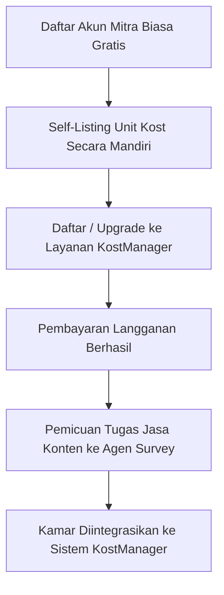

# FOKUS PENGEMBANGAN - RuangSinggah Semi Pasar Bebas & KostManager

Dokumen ini berisi peta jalan (roadmap) dan cetak biru pengembangan jangka panjang untuk mentransformasi platform RuangSinggah menjadi ekosistem semi pasar bebas terintegrasi. Dokumen ini menjadi acuan mutlak bagi seluruh agen pengembang dalam merancang dan memodifikasi fitur-fitur baru ke depan.

---

## 1. Visi Utama: Ekosistem Semi Pasar Bebas
Kita akan mengubah model bisnis RuangSinggah dengan membaginya menjadi dua pilar:
1. **Self-Listing Gratis (Pasar Bebas)**:
   - Pemilik kost (Mitra) dapat mendaftar secara mandiri secara gratis.
   - Mengunggah unit kost mereka secara mandiri ke marketplace RuangSinggah tanpa kurasi penuh di awal.
2. **Layanan KostManager (Premium Subscription)**:
   - Layanan manajemen kost terkelola penuh (fully-managed) oleh tim RuangSinggah.
   - Sistem berlangganan bulanan/tahunan bagi pemilik kost untuk mendapatkan pengelolaan utuh: pembuatan konten promosi, pemasaran kamar kosong, integrasi manajemen penghuni kamar, otomatisasi penagihan uang sewa, dan laporan keuangan komprehensif bagi pemilik kost.

---

## 2. Alur Perjalanan Pengguna (User Journey)
### A. Sisi Pemilik Kost (Mitra)

1. **Pendaftaran Gratis**: Mitra mendaftar secara cuma-cuma dan langsung bisa melakukan self-listing kost dasar.
2. **Upgrade Layanan**: Mitra memilih untuk berlangganan layanan premium **KostManager**.
3. **Pemicuan Tugas Konten**: Sebagian biaya langganan yang dibayarkan Mitra dialokasikan secara otomatis untuk menyewa **Agen Survey** terdekat.
4. **Integrasi Operasional**:
   - Agen Survey mengunjungi lokasi untuk membuat konten pemasaran profesional seluruh kamar.
   - Semua kamar diintegrasikan dengan database KostManager.
   - Seluruh penghuni kost terdata akan melakukan pembayaran sewa dan perpanjangan secara otomatis lewat aplikasi RuangSinggah.
   - Kamar yang kosong akan di-push secara prioritas (boosted) di marketplace RuangSinggah.

### B. Sisi Agen Survey (Surveyor & Recruiter)
- **Peran Ganda**: Agen Survey bertindak sebagai auditor lapangan (pembuat konten pemasaran kamar) sekaligus agen akuisisi (recruiter) Mitra baru.
- **Sistem Referral**:
  - Setiap Agen Survey memiliki kode referral unik yang tercatat di profil mereka.
  - Saat mendaftar sebagai Mitra biasa, terdapat opsi input kode referral Agen.
  - Jika Mitra yang dirujuk meng-upgrade akunnya ke layanan **KostManager**, Agen Survey pemilik kode referral akan menerima komisi/pendapatan pasif secara berkala sebagai bonus akuisisi.

---

## 3. Rencana Rilis Fitur Bertahap (Roadmap)

### Tahap 1: Sistem Referral Agen & Registrasi Tersegmentasi (FOKUS AWAL)
1. **Kode Referral Agen**:
   - Menambahkan kolom `referral_code` unik pada data profil Agen Survey (dihasilkan secara otomatis, misal `AG-XXXXXX`).
   - Menampilkan kode referral di Dashboard Agen.
2. **Pilihan Peran Pendaftaran (Sign-up Segmented)**:
   - Mendesain ulang antarmuka Register/Login di `Login.tsx` untuk memberikan pilihan peran secara eksplisit: **Masuk sebagai Pencari Kost** vs **Masuk sebagai Pemilik Kost**.
3. **Input Referral pada Pendaftaran Mitra**:
   - Menambahkan form input `referral_code` opsional ketika pemilik kost mendaftar akun baru.
   - Memvalidasi kode referral tersebut ke tabel user/agen dan mencatat hubungan afiliasi jika valid.

### Tahap 2: Transisi Berlangganan KostManager
- Implementasi checkout langganan KostManager untuk akun Mitra biasa.
- Modifikasi dashboard Mitra biasa agar memiliki menu upgrade "KostManager".
- Integrasi otomatisasi order survey konten ketika pembayaran langganan selesai.

### Tahap 3: Modul Operasional KostManager
- Panel pengelolaan kamar per unit secara mendetail (penghuni aktif, tanggal jatuh tempo sewa, riwayat sewa).
- Integrasi sistem penagihan tagihan sewa otomatis via WhatsApp / Email.
- Modul Laporan Keuangan (pemasukan, pengeluaran operasional, net profit) untuk pemilik kost.
